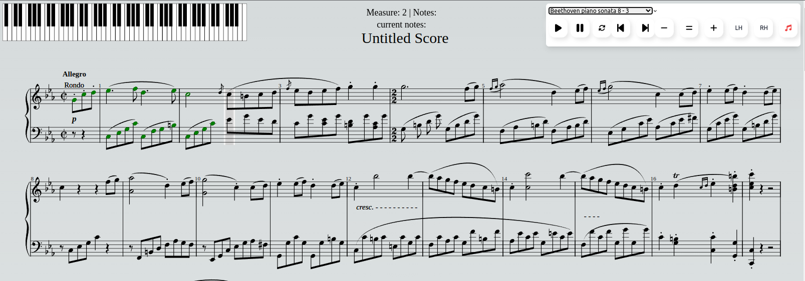

# Piano Project

A web-based interactive piano learning assistant that lets you track your progress.



This is a [Next.js](https://nextjs.org/) project bootstrapped with [`create-next-app`](https://github.com/vercel/next.js/tree/canary/packages/create-next-app).

## Installation

1. Clone the repository:

   ```bash
   git clone https://github.com/christianLB/piano.git

   ```

2. cd piano
3. npm install

## Getting Started

First, run the development server:

```bash
npm run dev
# or
yarn dev
# or
pnpm dev
# or
bun dev
```

Open [http://localhost:3000](http://localhost:3000) with your browser to see the result.

## Usage

1. Open your browser and go to `http://localhost:3000`.
2. Use your keyboard or click on the piano keys to play notes.

## Features

- Loads up a musicXML file using Open Sheet Music Display (https://opensheetmusicdisplay.github.io/)
- Piano Roll feedback of played notes.
- Cursor score navigation.
- Highlights correctly played notes under the cursor.
- Automatically jumps to the next beat when all notes are played correctly.
- Allows for separate hands tracking.

## Contributing

1. Fork the repository.
2. Create a new branch for your feature or bug fix.
3. Submit a pull request.

## License

MIT
